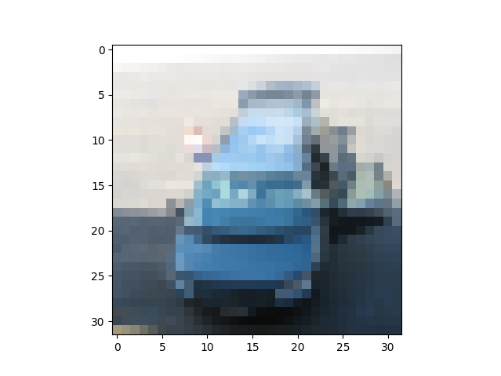
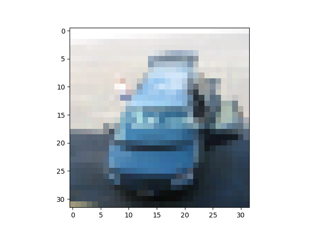

# Convolutional Neural Network

## About the project

Aim of this project is to use **Convolutional Neural Networks (CNNs)** for the problem of classification on [CINIC10 dataset](#about-the-dataset). See also [adversarial attacks](#adversarial-attack) section.

This project is a part of course in Deep Learning at Warsaw University of Technology, summer semester 2024/2025.

## Dataset

### About the dataset

The CINIC10 dataset contains $10$ classes (airplane, automobile, bird, cat, deer, dog, frog, horse, ship, truck).
Each datapoint is a picture in resolution $32 \times 32$ with $3$ colour channels.

### Prepare the dataset

1. Download the **CINIC10 dataset** from [here](https://www.kaggle.com/datasets/mengcius/cinic10).
2. Extract the archive. Save it under `./data` directory. The dataset should be already split int **train**, **test** and **valid**.


## Directory structure

Ensure your directory is strucutred as below:
```{bash}
.
├── data/                
│   ├── train/
│   │   ├── airplane/
│   │   ├── automobile/ 
│   │   └── etc.../ 
│   ├── valid/
│   │   ├── airplane/
│   │   ├── automobile/ 
│   │   └── etc.../ 
│   └── test/
│       ├── airplane/
│       ├── automobile/ 
│       └── etc.../ 
├── models/
├── process_models/ 
│   ├── readme.md
│   ├── adversarial_attack/
│   │   ├── adversarial_attack.py
│   │   ├── adversarial_dataset.py 
│   │   └── readme.md
│   ├── further_train/
│   │   ├── further_train.py
│   │   └── readme.md 
│   └── model_analysis/
│       ├── model_analysis.py
│       └── readme.md 
├── main.py
├── readme.md
└── .gitignore
```

## Setup

**Linux**:  
Create virual environment:
```{Bash}
python3 -m venv venv
source venv/bin/activate
```
Install required libraries:
```{Bash}
pip install torch torchvision torchsummary tqdm matplotlib scikit-learn seaborn kornia
```
Ensure you have `tkinter` installed. If not, install it:
```{bash}
sudo apt-get update
sudo apt-get install python3-tk
```

## How to use

Run `main.py` to train the model. You are welcome to experiment with architecture. After training the model go to `/process_models` to do further experiments.

## Adversarial attack

The most interesting part of the project is adversarial attack.
If you want to read more about adversarial attacks [read here](https://en.wikipedia.org/wiki/Adversarial_machine_learning).

**Example:**

Before attack            |  Afer attack
:-------------------------:|:-------------------------:
  |  

Even though for human picutres above seems the same, model is confused:
```{bash}
Loss without attack: 0.06967619806528091
Prediction without attack: car
Loss with attack: 1.4984451532363892
Prediction with attack: truck
```


